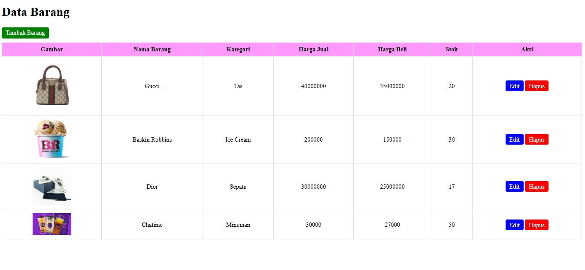

1. Codingan PHP nya :

```ruby
<!DOCTYPE html>
<html lang="en">
<head>
    <meta charset="UTF-8">
    <meta name="viewport" content="width=device-width, initial-scale=1.0">
    <title>CRUD Barang</title>
    <style>
        table {
            width: 100%;
            border-collapse: collapse;
        }

        th, td {
            border: 1px solid #ddd;
            padding: 8px;
            text-align: center;
        }

        th {
            background-color: #FF99FF;
        }

        .btn {
            padding: 5px 10px;
            text-decoration: none;
            color: white;
            border-radius: 4px;
        }

        .btn-edit {
            background-color: blue;
        }

        .btn-hapus {
            background-color: red;
        }

        .btn-tambah {
            background-color: green;
            margin-bottom: 10px;
            display: inline-block;
        }
    </style>
</head>
<body>
    <h1>Data Barang</h1>

    <a href="?tambah" class="btn btn-tambah">Tambah Barang</a>

    <table>
        <thead>
            <tr>
                <th>Gambar</th>
                <th>Nama Barang</th>
                <th>Kategori</th>
                <th>Harga Jual</th>
                <th>Harga Beli</th>
                <th>Stok</th>
                <th>Aksi</th>
            </tr>
        </thead>
        <tbody>
            <?php while ($row = $result->fetch_assoc()): ?>
                <tr>
                    <td>" alt="Gambar" width="100"></td>
                    <td><?= htmlspecialchars($row['nama']) ?></td>
                    <td><?= htmlspecialchars($row['kategori']) ?></td>
                    <td><?= htmlspecialchars($row['harga_jual']) ?></td>
                    <td><?= htmlspecialchars($row['harga_beli']) ?></td>
                    <td><?= htmlspecialchars($row['stok']) ?></td>
                    <td>
                        <a href="?edit=<?= $row['id_barang'] ?>" class="btn btn-edit">Edit</a>
                        <a href="?hapus=<?= $row['id_barang'] ?>" class="btn btn-hapus" onclick="return confirm('Yakin ingin menghapus?')">Hapus</a>
                    </td>
                </tr>
            <?php endwhile; ?>
        </tbody>
    </table>

    <?php if (isset($_GET['tambah']) || isset($_GET['edit'])): ?>
        <form method="post" enctype="multipart/form-data">
            <input type="hidden" name="id_barang" value="<?= htmlspecialchars($dataEdit['id_barang']) ?>">
            <label>Nama Barang:</label><br>
            <input type="text" name="nama" value="<?= htmlspecialchars($dataEdit['nama']) ?>" required><br>
            <label>Kategori:</label><br>
            <input type="text" name="kategori" value="<?= htmlspecialchars($dataEdit['kategori']) ?>" required><br>
            <label>Gambar:</label><br>
            <input type="file" name="gambar" <?= isset($_GET['tambah']) ? 'required' : '' ?>><br>
            <?php if (isset($_GET['edit']) && !empty($dataEdit['gambar'])): ?>
                " alt="Gambar" width="100"><br>
            <?php endif; ?>
            <label>Harga Jual:</label><br>
            <input type="number" name="harga_jual" value="<?= htmlspecialchars($dataEdit['harga_jual']) ?>" required><br>
            <label>Harga Beli:</label><br>
            <input type="number" name="harga_beli" value="<?= htmlspecialchars($dataEdit['harga_beli']) ?>" required><br>
            <label>Stok:</label><br>
            <input type="number" name="stok" value="<?= htmlspecialchars($dataEdit['stok']) ?>" required><br><br>
            <button type="submit" name="<?= isset($_GET['edit']) ? 'update' : 'tambah' ?>">
                <?= isset($_GET['edit']) ? 'Update' : 'Tambah' ?>
            </button>
        </form>
    <?php endif; ?>
</body>
</html>
```


